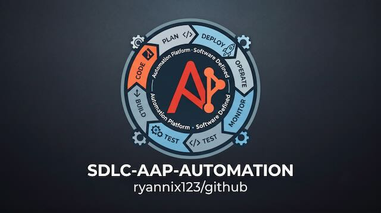

<p align="center">
  
</p>

<h1 align="center">AAP Automation Platform</h1>

<p align="center"><strong>One platform. Every endpoint. Real engineering discipline.</strong></p>

<p align="center">
A single repository that automates the whole estate — cloud, on-prem, storage,
network, Windows, and Linux — governed like software and driven from ServiceNow.
</p>

---

## The idea

Most automation isn't engineered. It's a pile of scripts: unreviewed, untested,
owned by no one, and locked into one tool's proprietary language. The moment it
matters in production, that's a liability.

This repository is the opposite. Every change to every domain flows through the
same software development lifecycle your application teams already trust — a Git
branch, a validated pull request, an owning-team review, and a clean promotion
path to production. The automation that results is plain, portable YAML that runs
anywhere `ansible-core` runs.

> **One platform. Every endpoint. Real discipline.** That's the whole pitch, and
> this repo is the working proof.

## Why Ansible is the engine

| | |
|---|---|
| **Open source** | Plain-YAML content on upstream `ansible-core`. Your automation is portable — there is no proprietary language to leave. The subscription buys the supported platform around your content, not a lock-in. |
| **Agentless** | Reaches targets over SSH, WinRM, and HTTPS APIs. Nothing to install, patch, or secure on every managed node. |
| **Low-code & fast** | Human-readable YAML. Teams are productive in days, not weeks — far less ramp than a custom DSL. |
| **Certified content** | 60+ certified partners — Cisco, Microsoft, NetApp, ServiceNow and more — with Red Hat support behind the collections you depend on. |
| **Day 1 *and* Day 2** | Provisioning *and* ongoing operations in one engine. No second tool, no second skill set, no second audit trail. |

## Something for every team

The same platform, the same SDLC, and the same self-service front door drive the
entire estate. Each domain lives in its own folder, owned by the team that runs it.

| Folder | Team | What it automates |
|--------|------|-------------------|
| [`cloud/`](cloud/) | Cloud | AWS / Azure / GCP VM provisioning |
| [`vm/`](vm/) | Virtualization | Nutanix (and VMware) VM lifecycle |
| [`storage/`](storage/) | Storage | NetApp / Pure / Dell volume provisioning |
| [`network/`](network/) | Network | Infoblox / Cisco / Arista changes (DNS, etc.) |
| [`servers/`](servers/) | Windows + Linux | Day-2 config & compliance, agentless |

## How it stays governed

A single monorepo is only a benefit if it doesn't become a bottleneck. The common
mistake is to make a few platform admins the sole approvers — which is slow and
puts approval in the hands of people who may not understand the change. Two GitHub
features prevent that:

| Mechanism | What it does |
|-----------|--------------|
| [`.github/CODEOWNERS`](.github/CODEOWNERS) | Routes each PR to the **owning team** for the folder it touches. A `network/` change needs Network-team approval; `storage/`, the Storage team; and so on. |
| Branch protection on `main` | Requires a passing CI pipeline **and** Code-Owner approval before merge. Nobody — including admins — self-merges. |

The result is **distributed accountability with central standards**: domain experts
approve the changes they understand, platform admins own the shared rails
(`/.github/`, `/collections/`, `/common/`, `/eda/`). See
[`docs/branch-protection.md`](docs/branch-protection.md) for the exact settings.

## The SDLC, in one loop

Every domain follows the identical flow — the engine never changes, only the target.

```
Branch  →  Validate  →  Review  →  Merge  →  Promote  →  Request  →  Execute  →  Report
 (Git)   (lint +      (owning   (main)   (Dev→Test    (ServiceNow  (AAP job   (write-back
          Molecule)    team)              →Prod)       catalog)     template)   to ticket)
```

1. Engineer works on a `feature/*` branch in their domain folder.
2. The PR triggers `yamllint` + `ansible-lint` repo-wide, and `molecule test` for
   **only the domain(s) that changed** — path-filtered, so the repo stays fast.
3. CODEOWNERS requests the owning team's review; branch protection blocks merge
   until it's approved and CI is green.
4. On merge, the AAP Project syncs from SCM; promotion to Test then Prod is an
   explicit, logged step.
5. A ServiceNow catalog request → approval → AAP job template → result written
   back to the ticket by the shared [`servicenow_writeback`](common/roles/servicenow_writeback/) role.
6. [Event-Driven Ansible](eda/) reuses the same job templates to remediate
   automatically when something drifts.

## Repository layout

```
aap-automation-platform/
├── img/                        # hero image (aap-sdlc.jpeg)
├── .github/
│   ├── CODEOWNERS              # per-folder review routing (the governance core)
│   └── workflows/ci.yml        # GitHub Actions: lint repo-wide, Molecule per changed domain
├── .gitlab-ci.yml              # GitLab CI equivalent (same path-based rules)
├── collections/requirements.yml
├── execution-environment/      # ansible-builder EE definition (shared)
├── common/
│   └── roles/servicenow_writeback/   # shared result write-back, reused by all domains
├── cloud/ vm/ storage/ network/ servers/   # one folder per domain team, each with:
│   ├── roles/<role>/           #   tasks, defaults, meta, molecule scenario
│   ├── playbooks/              #   thin wrappers launched by AAP job templates
│   ├── README.md               #   domain summary
│   └── SDLC.md                 #   step-by-step contribution guide for this domain
├── eda/rulebooks/              # event-driven remediation
└── docs/branch-protection.md
```

## Quick start

```bash
git clone git@github.com:org/aap-automation-platform.git
cd aap-automation-platform

# Install collections into the repo-local path (matches CI and the EE)
ansible-galaxy collection install -r collections/requirements.yml

# Lint everything
yamllint .
ansible-lint

# Test one domain's role (network is the fully-wired reference)
cd network/roles/manage_dns_record && molecule test
```

## Where to go next

- **New contributor?** Read [`CONTRIBUTING.md`](CONTRIBUTING.md) for the full
  branch → PR → review → merge walkthrough, or the `SDLC.md` inside your domain
  folder for a domain-specific version.
- **Reference test pattern:** [`network/roles/manage_dns_record/molecule/default/README.md`](network/roles/manage_dns_record/molecule/default/README.md)
  shows how each role is tested in CI without live infrastructure.
- **Wiring into AAP:** see [Mapping the monorepo to AAP](#mapping-the-monorepo-to-aap) below.

## Mapping the monorepo to AAP

Two clean options for wiring this single repo into Automation Controller:

- **One Project, many job templates (simplest).** One Controller *Project* pointed
  at this repo; a job template per playbook with its `playbook` field set to the
  domain path (e.g. `network/playbooks/manage_dns_record.yml`).
- **One Project per domain, scoped by organization (stronger RBAC).** A Project
  per domain, all pointing at the same repo, each assigned to the matching
  Controller *Organization*. Controller RBAC then mirrors the CODEOWNERS model.

Either way the **execution environment** is shared, built from
`execution-environment/execution-environment.yml`.

## No lock-in, by design

Everything here is plain YAML on `ansible-core`. `yamllint`, `ansible-lint`,
`molecule`, and `ansible-builder` are upstream open-source tools. The collections
are open source and published on Ansible Galaxy as well as in the certified
channel. The AAP subscription adds the supported Controller, certified content,
execution environments, EDA, RBAC, and support — not a language you can't leave.
